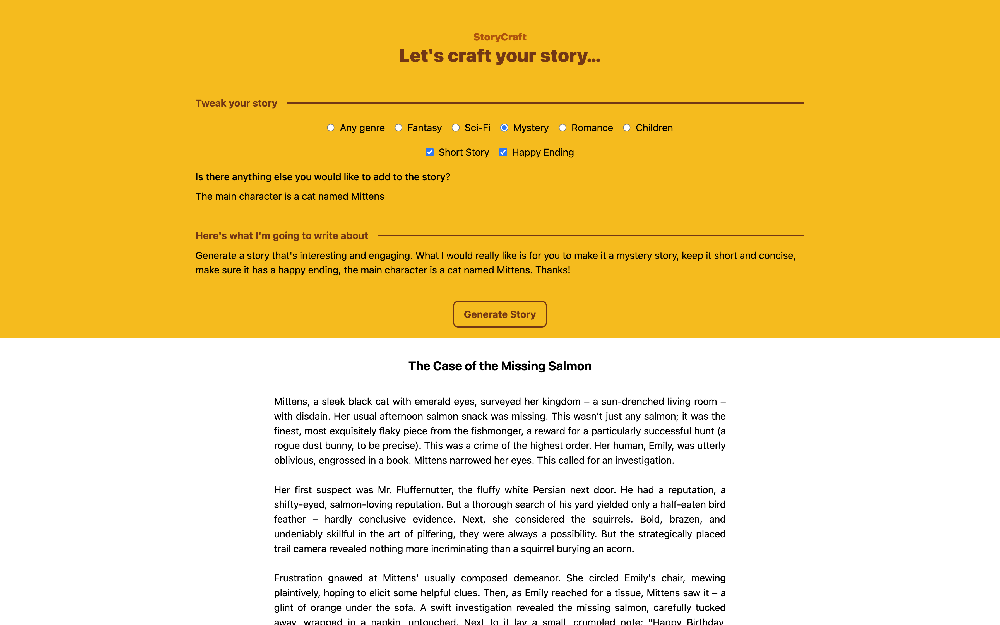

# StoryCraft

StoryCraft is a small project I created that enables you to create stories with multiple choices and endings, using Google Gemini. Tweak your story by choosing the genre, ending, length, and more.

## Development

This project was created using Svelte and Google Gemini API. To run the project, you need to have a Google AI Studio account created and a (free) API key to put in the `.env` file.

## Design

I used Tailwind 4.0 for the design of the project. The design is simple and clean, with a focus on the story and choices.

## Example

Using these parameters: Any Genre, Short Story, Happy Ending, The main character is a cat named Mittens.

**Mittens and the Midnight Melody**

Mittens, a sleek black cat with emerald eyes, lived a comfortable life, spoiled rotten by her elderly owner, Mrs. Higgins. But Mittens craved adventure. One night, a hauntingly beautiful melody drifted in through Mrs. Higgins' open window. It was unlike anything Mittens had ever heard, a lilting tune that seemed to call to her. Driven by an irresistible urge, she slipped out into the moonlit night.

Following the music, Mittens navigated the shadowy alleys and quiet streets. The melody led her to a hidden courtyard, where a small group of musicians – a mischievous squirrel on the violin, a philosophical owl on the flute, and a surprisingly talented frog on the drums – were serenading a shy little field mouse. The mouse was too frightened to join in, but the music was enchanting.

Mittens, usually aloof, felt a surge of warmth. She boldly approached, her tail twitching. Her presence seemed to embolden the mouse, who hesitantly began to tap out a rhythm on a nearby stone. The musicians welcomed her with open paws, and soon, Mittens was purring along to the magical music, her soft meows adding a unique counterpoint to the ensemble. The courtyard filled with laughter and joy.

As dawn approached, the impromptu concert ended. The musicians thanked Mittens for her unexpected contribution. Feeling a deep sense of belonging and fulfillment, Mittens returned home, her heart full of the night's magic. That night, she dreamt not of tuna, but of music and friendship, a happy memory she cherished forever. From then on, she would occasionally hear the faintest melody from Mrs. Higgins' window, a reminder of her extraordinary midnight adventure.

## Author

The project was made by Dominic Satnoianu. Use it as you wish, but please give credit where it's due :)